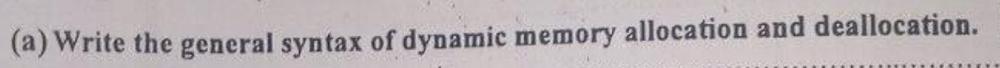
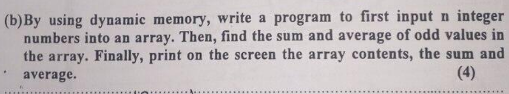
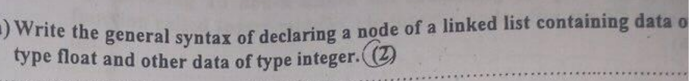
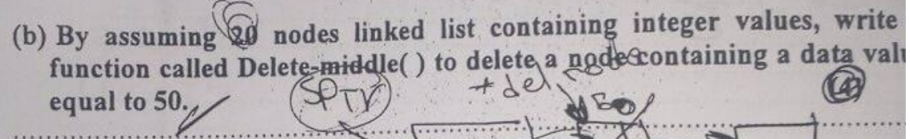
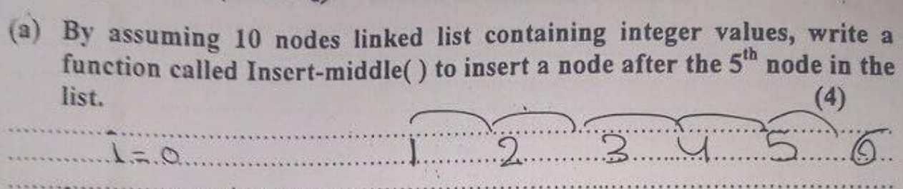
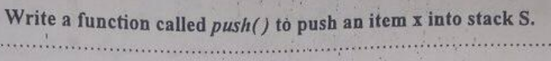
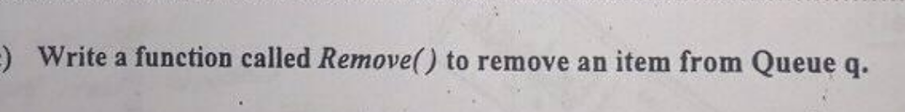

# 2016 Final
---

###  1

```cpp
//declare pointer
int* a;
//alloc
a = new int;
//assign value
*a = 5;
//dealloc
delete a;
```
###  2

```cpp
#include <iostream>
using namespace std;

int main() {
    int n;
    cout << "Enter n:";
    cin >> n;
    int *arr = new int[n];
    int sum = 0;
    for(int i=0;i<n;i++){
        cout << i << "#:";
        cin >> arr[i];
        sum += arr[i];
    }
    cout << "Sum:" << sum << endl;
    cout << "Avg:" << (float)sum/n << endl;
}
```
###  3

```cpp
struct node{
    float f;
    int i;
    node* next;
}
```

###  4

```cpp
void deleteMiddle(node*& head,int value){
    if(head==NULL){
        return;
    }else if(head->val == value){
        node* old_head = head;
        node* new_head = head->next;
        delete old_head;
        head = new_head;
        return;
    }

    node* to_delete = head->next;
    node* prev = head;

    while (to_delete != NULL && to_delete->val != value) {
        prev = to_delete;
        to_delete = to_delete->next;
    }

    prev->next = prev->next->next;
    delete prev;
}
```
###  5

```cpp
void insertMiddle(node*& head,int val){
    node* new_node = new node;
    new_node->val = val;

    node* cur_node = head;
    int c = 1;
    while(c!=5 && cur_node!=NULL){
        cur_node = cur_node->next;
        c++;
    }
    new_node->next = cur_node->next;
    cur_node->next = new_node;
}
```
###  6

```cpp
void push(int value){
    if(stk.s[0] == STACK_SIZE - 1){
        cout << "STACK IS FULL\n";
        return;
    }
    stk.s[0]++;
    stk.s[stk.s[0]] = value;
}
```
###  7

```cpp

```
