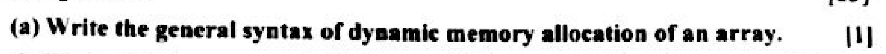
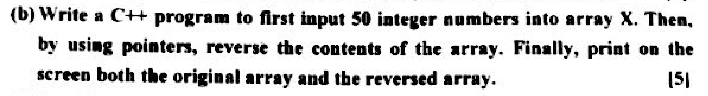
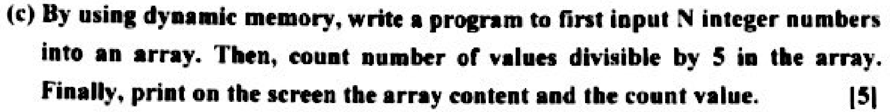
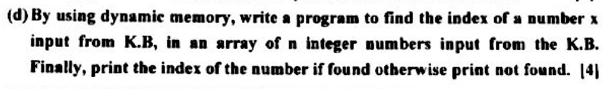

# 2017 Final
---

##  Question 1


```cpp
int size = 100;
int *x = new int[size];
```



```cpp
int x[50];
int *ptr = new int[50];
//Enter into array
for(int i=0;i<50;i++)
    cin >> x[i];
//Enter into pointer from index 49 to index 0
for(int i=0;i<50;i++)
    ptr[i] = x[49-i];
//print both
for(int i=0;i<50;i++){
    cout << "x["<< i <<"] = " << x[i] << endl;
    cout << "ptr["<< i <<"] = " << ptr[i] << endl;
}
```

```cpp
int n;
cin >> n;
int *arr = new int[n];
int count = 0;
//input
for(int i=0;i<n;i++){
    cin >> arr[i];
    if(arr[i]%5==0)
        count++;
}
//output
cout << "Count:" << count << endl;
for(int i=0;i<n;i++){
    cout << arr[i] << endl;
}
```

```cpp
int n;
cin >> n;
int *arr = new int[n];
int x;
int index = -1;
//input
for(int i=0;i<n;i++)
    cin >> arr[i];

cout << "Search:";
cin >> x;

for(int i=0;i<n;i++){
    if(arr[i] == x){
        index = i;
        break;
    }
}

if(index == -1){
    cout << "Not found!!";
}else{
    cout << x << " is found at " << index;
}
    
```