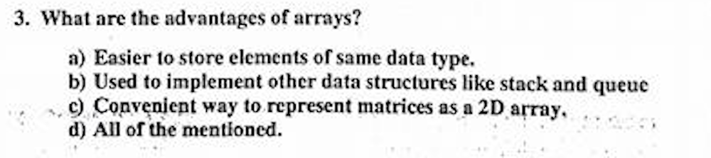

# 2017 Midterm (A)

---

## 1

**a) Underflow**


**c) 3**


**d) all of the mentioned**


**b) false**


**a) true**


**c) possible if X is not the first node.....**


**a) before deletion**


**a) 20**


## 2


[للبرنامج كامل (اضغط هنا)](./addAfter50.cpp) 

```cpp
void addAfter5(Node* head,int value){
    Node* nn = new Node;
    nn->value = value;
    
    int i = 1;
    
    Node* cur = head;
    Node* prev;
    while(i<5){
        prev = cur;
        cur = cur->next;
        i++;
    }
    
    nn->next = cur;
    prev->next = nn;
}
```

## 3


```1
INFIX:  (A-B)*(C+D)*E/(F+G)
POSTFIX: A B - C D + * E * F G + /
PREFIX:  / * * - A B + C D E + F G
```


```cpp
if(prev != NULL){
    *head = prev;
}
```


**Queue outputs input in the same orrder that it was enterd with (First in First out)**    
**Stack outputs input in a reversed orrder(First in Last out)**

```cpp
/**
 * Array
 **/

struct Queue{
    int front;
    int rear;
    int data[100];
};

/**
 * Linked List
 **/

struct QueueNode{
    int value;
    QueueNode* next;
};

```