# 2017 Midterm (لآ)

---

## 1

**c) Overflow**
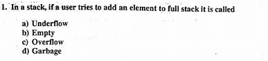

**d) 31 and 5 respectively**    
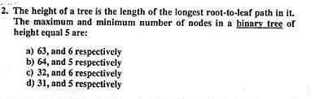

**c) 3**    
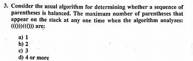

**a) Stack**    
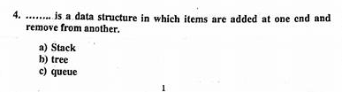

**b) 30**   
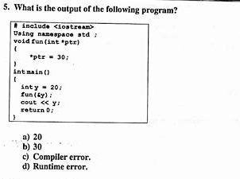

**c) 3**    
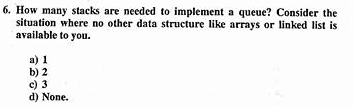

**d) 31 and 5**    
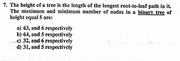

**d) None of the mentioned**    
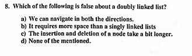

## 2

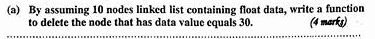
[للبرنامج كامل (اضغط هنا)](./delete30.cpp) 

```cpp
void delete30(Node*& head){
    if(head->value == 30){
        Node* temp = head;
        head = head->next;
        delete temp;
        return;
    }
    
    Node* rem = head->next;
    Node* prev = head;
    while(rem->value!=30){
        prev = rem;
        rem = rem->next;
    }
    
    prev->next = rem->next;
    delete rem;
}
```

## 3

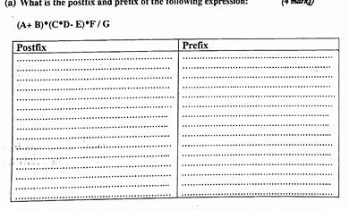

```1
INFIX:  (A+B)*(C*D-E)*F/G
POSTFIX: A B + C D * E - * F * G /
PREFIX:  / * * + A B - * C D E F G
```
---
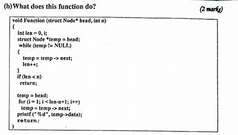    
**Print n node**
---
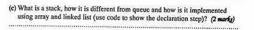
**Queue outputs input in the same orrder that it was enterd with (First in First out)**    
**Stack outputs input in a reversed orrder(First in Last out)**

```cpp
/**
 * Array
 **/

struct Stack{
    int top;
    int data[100];
};

/**
 * Linked List
 **/

struct StackNode{
    int value;
    StackNode* prev;
};

```