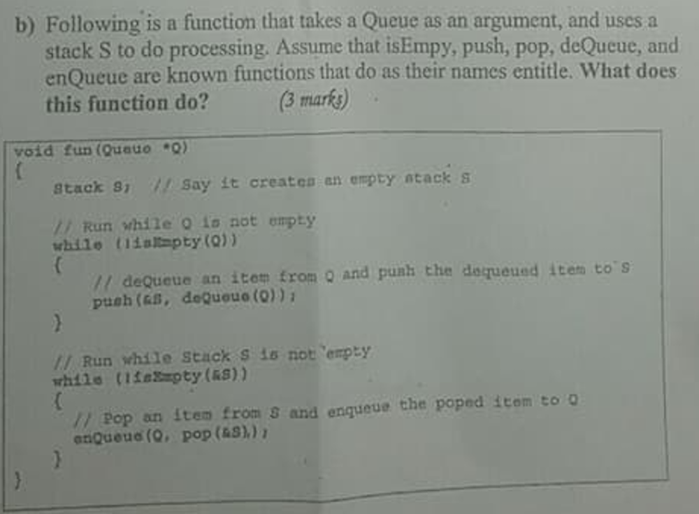
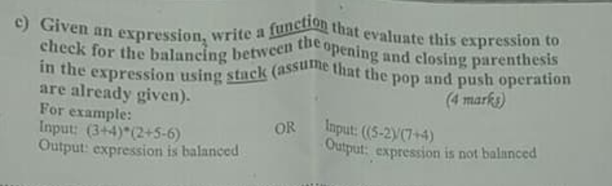

# 2018 Midterm eXtra
---

##  1
### a

```markdown
** INFIX **
``A*(B-C*D-E)*F
** POSTFIX **
A B C D * - E - * F *
** PREFIX **
* * A - - B * C D E F
```

### b

This snippet of code reverse the orrder of the queue.    
الكود بيعكس الكيو عن طريق انة بيخرج العناصر منها بالترتيب ويدخلهم ف الإستاك. بعد كدا هيخرجهم من الإستاك يرجعهم الكيو تاني بس علشان الإستاك بيعكس الخرج هيبقي الناتج هو عكس الكيو الأصلية

### c


[للبرنامج كامل (اضغط هنا)](/isBalanced.cpp) 

```cpp

bool isBalanced(char expression[]){
    Stack s;
    char c = expression[0]; //starting value
    int i = 0;
    
    //while to loop over the string
    //string have '\0' ending
    while(c!='\0'){
        
        if(c == '('){
            push(s,'(');
        
        }else if(c == ')'){
            
            if(s.top == -1)
                return false;
            else
                pop(s);
        }
        i++;
        c = expression[i];
    }
    
    
    //check if there is '(' still not removed
    if(isEmpty(s)){
        return true;
    }else{
        //stack is not empty and expression is not balanced
        return false;
    }
}

int main() {
    char exp1[] = "(3+4)*(2+5-6)";
    char exp2[] = "((5-2)/(7+4)";
    
    if(isBalanced(exp1)){
        cout << exp1 << " is balanced" << endl;
    }else{
        cout << exp1 << " is not balanced" << endl;
    }
    
    if(isBalanced(exp2)){
        cout << exp2 << " is balanced" << endl;
    }else{
        cout << exp2 << " is not balanced" << endl;
    }

    return 0;
}
```

## 2

### a


[للبرنامج كامل (اضغط هنا)](./addAfter5.cpp) 

```cpp
void addAfter50(node*& head,int value){
    node* cur = head;
    
    while(cur->value != 50){
        cur = cur->next;
    }
    
    node* new_node = new node;
    new_node->value = value;
    new_node->next = cur->next;
    cur->next = new_node;
}
```

## b

this snippet of code reverses the orrder of the doubly linked list

```markdown
# OUTPUT #
6 <-> 5 <-> 4 <-> 3 <-> 2 <-> 1
```

## 3

```cpp
struct StackNode{
    int value;
    StackNode* prev;
} *top = NULL;

struct QueueNode{
    int value;
    QueueNode* next;
} *front = NULL;
``` 